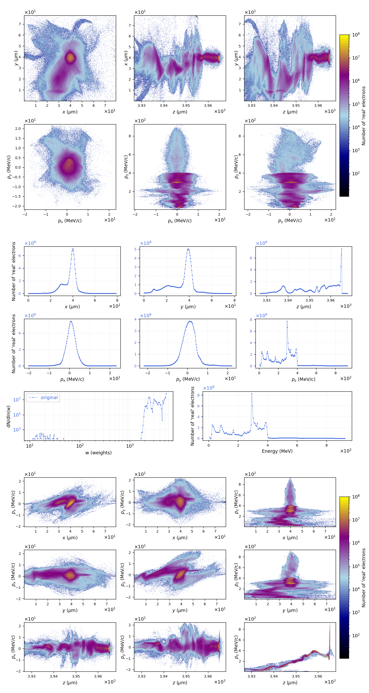
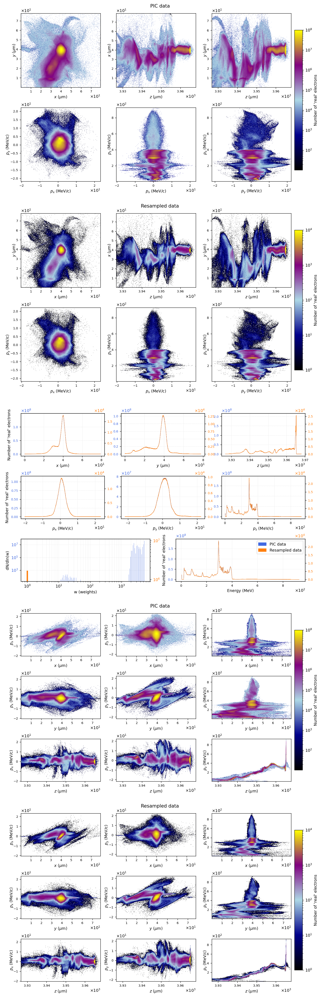

## Output

This is the output of `usage.py h5/gas_126175.h5`

Data generated using PIConGPU 0.6.0.

h5/gas_126175.h5 contains iteration 126175, at 13.33 ps.

Swapping y and z axes.

The particle bunch is propagating along the z direction.

The dataset contains 4,332,044 macroparticles, corresponding to 16,716,122,112 'real' electrons.

Descriptive statistics of the dataset:

```

       position_x_um  position_y_um  position_z_um  ...  momentum_z_mev_c       weights    energy_mev
count   4.332044e+06   4.332044e+06   4.332044e+06  ...      4.332044e+06  4.332044e+06  4.332044e+06
mean    3.993921e+01   3.782326e+01   2.086262e+01  ...      1.748451e+02  3.858715e+03  1.749383e+02
std     7.965802e+00   9.775765e+00   1.129096e+01  ...      1.546655e+02  1.162251e+03  1.545994e+02
min     2.318445e-03   1.408680e-04   1.454365e-05  ...      1.123521e+00  1.007878e+01  1.350325e+00
25%     3.622627e+01   3.430883e+01   1.074843e+01  ...      2.553058e+01  2.919472e+03  2.579756e+01
50%     3.981729e+01   3.808156e+01   2.117945e+01  ...      1.229009e+02  3.808745e+03  1.229675e+02
75%     4.227043e+01   4.137350e+01   3.121758e+01  ...      3.233034e+02  5.119417e+03  3.233278e+02
max     7.917679e+01   7.787860e+01   4.255122e+01  ...      7.983059e+02  5.442342e+03  7.983159e+02

[8 rows x 8 columns]

```

The (weighted) mean energy is 2.148729e+02 MeV.

Wrote plots/phase_space.png

<a href="plots/phase_space.png"></a>

Reducing number of particles.

The dataset contains 2,167,504 macroparticles, corresponding to 2,167,504 'real' electrons.

Descriptive statistics of the dataset:

```

       position_x_um  position_y_um  position_z_um  ...  momentum_z_mev_c    weights    energy_mev
count   2.167504e+06   2.167504e+06   2.167504e+06  ...      2.167504e+06  2167504.0  2.167504e+06
mean    4.014570e+01   3.779658e+01   2.396815e+01  ...      2.147524e+02        1.0  2.148256e+02
std     6.812065e+00   8.731257e+00   1.097691e+01  ...      1.572316e+02        0.0  1.571711e+02
min     4.202477e-03   6.272237e-04   1.777614e-04  ...      1.280980e+00        1.0  1.507752e+00
25%     3.773128e+01   3.504658e+01   1.585886e+01  ...      4.260918e+01        1.0  4.272880e+01
50%     4.017075e+01   3.827232e+01   2.571966e+01  ...      2.751293e+02        1.0  2.751438e+02
75%     4.215109e+01   4.107590e+01   3.383397e+01  ...      3.477281e+02        1.0  3.477480e+02
max     7.913539e+01   7.787860e+01   4.166655e+01  ...      7.508385e+02        1.0  7.508405e+02

[8 rows x 8 columns]

```

Wrote plots/comparative_phase_space.png

<a href="plots/comparative_phase_space.png"></a>

Writing dataframe to file. This may take a while...

Wrote h5/gas_126175.txt

